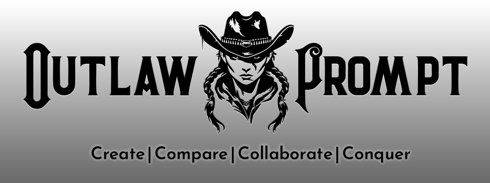

  

<h1 align="center">OutlawPrompt</h1>

  <strong>The Prompt Engineering Studio | Create. Compare. Conquer.</strong>

  <em>Create. Test. Perfect. Compare 12+ AI providers and 338+ models side-by-side. 
  Your prompts deserve a home worthy of their brilliance.</em>

  

  
  
  
  
  
  

  Next.js 15 | React 19 | PostgreSQL | TypeScript | Better Auth | Monaco Editor | Tailwind CSS

---

## Why OutlawPrompt?

### The Problem Every Prompt Engineer Knows Too Well

You've been there. We all have.

**Tab Hell.** It starts innocently—ChatGPT in one tab, Claude in another. Then you want to compare Gemini. Now Grok. Before you know it, you're juggling 47 browser tabs, copying the same prompt into each one, losing track of which response came from where, and your browser is begging for mercy.

**The Graveyard of Perfect Prompts.** That masterpiece you crafted last Tuesday—the one that made GPT-4 sound like Shakespeare crossed with a systems architect? Gone. Buried somewhere in a chat history you'll never find. You've written the same prompt from scratch three times now because you keep losing the good ones.

**The API Bill Surprise Party.** You experiment freely because you're learning, iterating, improving. Then the invoice arrives. $47? $120? *$340?* No idea which experiments cost what. No way to see the damage before it happens. Just surprise parties where nobody's celebrating.

**The Vibes-Based Model Selection.** "I *think* Claude is better for this?" "GPT-4o seems faster?" You're guessing. Everyone's guessing. There's no systematic way to actually test the same prompt across models and see who wins. Just vibes and Reddit threads.

**Copy-Paste Purgatory.** Your prompts live in Notion. Your test results are in Google Docs. Your persona definitions are in a text file. Your generated images are scattered across seventeen folders named "Downloads (1)". Finding anything takes archaeology.

**The Undo That Doesn't Exist.** You "improved" a working prompt. Tweaked the wording. Made it "better." And now it's broken. The old version? Gone. You didn't save it—why would you? You were just making a quick edit. Now you're recreating it from memory and it's never quite as good.

---

### The OutlawPrompt Solution

**One workspace. Every provider. Total control. Zero chaos.**

OutlawPrompt isn't another AI wrapper or chat interface. It's a complete prompt engineering environment—the professional workspace that serious AI practitioners deserve.

| Pain Point | OutlawPrompt Solution |
|------------|----------------------|
| Tab chaos across providers | **Test 6 models simultaneously** in one view. Same prompt, real-time streaming, side-by-side comparison. Watch them race. |
| Lost prompts | **Immutable version history** on every asset. Every save creates a new version. Diff view shows exactly what changed. Rollback is one click. Your work is *never* lost. |
| Surprise API costs | **Real-time cost tracking** with estimates *before* you run tests. Monthly budgets with alerts at 80% and 100%. Provider breakdowns. Model breakdowns. Know exactly where your dollars go. |
| Scattered organization | **Professional library** with Projects, Folders, Tags, Favorites, and full-text search. Your prompts organized like the valuable intellectual property they are. |
| Guessing which model is best | **Star ratings and leaderboards** that aggregate your judgments. Rate every response. See which models consistently win for *your* use cases. Data, not vibes. |
| No image generation workflow | **Five creative modes** purpose-built for AI image experimentation—including blind A/B testing that eliminates your biases. |
| Boring default themes | **40+ themes** out of the box. Unlimited custom themes. AI theme generation from text *or* images. 1800+ Google Fonts. Make it *yours*. |

> **The Competitive Advantage:** While others are tabbing between windows, losing their work, and guessing at model performance, you're running systematic comparisons, building a versioned library, and making data-driven decisions. That's not just convenience—it's leverage.

---

## The Testing Sandbox

*The heart of OutlawPrompt. The reason it exists. The feature you'll use every single day.*

### What It Actually Does

Imagine this: You have a prompt. You want to know which AI model handles it best. Instead of opening four browser tabs, copying your prompt into each one, waiting, comparing in your head, and forgetting which was which—you type your prompt once, select your models, and hit Run.

All responses stream in simultaneously. Character by character. You watch them think in real-time. Time-to-first-token shows who's fastest off the blocks. Token counts show who's verbose vs. concise. Cost estimates show who's expensive. And when they're done, you rate each response, and those ratings accumulate into a personal leaderboard that tells you which models consistently win for *your* kinds of tasks.

That's the Testing Sandbox.  

### The Provider Roster

<strong>12+ Providers, 338+ Models — Full List</strong>

| Provider | What You Get | Why It Matters |
|----------|--------------|----------------|
| **OpenAI** | GPT-4o, GPT-4 Turbo, o1, o3-pro | The industry standard. We support their new Responses API for cutting-edge models that only work with `/v1/responses`. |
| **Google Gemini** | Gemini 2.0, 1.5 Pro, 1.5 Flash | Google's multimodal powerhouses. We support their unique safety settings (per harm category) and thinking budget (128-2000 seconds for extended reasoning). |
| **Anthropic Claude** | Claude 3.5 Sonnet, Claude 3 Opus | The "thoughtful" models. Extended thinking support lets Claude show its work. |
| **Grok** | Grok-2, Grok-2 Vision | X.AI's models with that distinct personality. Vision support included. |
| **Deepseek** | Deepseek Chat, Deepseek Coder | The cost-effectiveness champion. Coding specialist that punches way above its price point. |
| **Mistral** | Mistral Large, Medium, Small | European AI excellence. Strong reasoning, multilingual prowess, surprisingly capable small models. |
| **Perplexity** | Sonar models | Web-connected AI that can cite sources. When your prompt needs current information. |
| **Huggingface** | Open source models | The entire open-source ecosystem. Point us at any Huggingface endpoint. |
| **Venice** | Privacy-focused models | Uncensored options for when you need them. Privacy-first philosophy. |
| **Ollama** | Your local models | Self-hosted AI on your own hardware. Your models, your rules, zero data leaving your machine. |
| **OpenRouter** | 338+ models | The universal gateway. One API key, hundreds of models. This is how we offer so many options. |
| **Requesty** | Custom endpoints | OpenAI-compatible custom endpoints for enterprise setups. |
| **Any OpenAI-Compatible** | Whatever you need | If it speaks the OpenAI API protocol, we can talk to it. Bring your own endpoint. |

### Three Modes for Three Workflows

**Comparison Mode** — The arena. 1-6 models, same prompt, fresh context every time. The ultimate showdown. You're answering the question: "Who handles *this specific task* best?"

**Conversation Mode** — The dialogue test. Multi-turn chat with persistent message history per model. You're testing: "How do these models handle extended conversations? Do they remember context? Do they drift?"

**Batch Mode** — The matrix. M prompts x N models = systematic evaluation at scale. Queue up a dozen prompts, pick your models, hit Run, walk away. It runs them all. Pause/resume included. Export the results. This is how you evaluate at scale.

### The Intelligence Layer

Every test run captures more than just the response:

- **Time-to-First-Token (TTFT)** — The moment the first character appears. Sub-second differences matter for user experience. You'll see which models are snappy and which make you wait.

- **Token Counting** — Input tokens, output tokens, per lane. Know exactly what you're sending and receiving. Some models are chatty; some are terse. The numbers don't lie.

- **Cost Estimates** — Before you run (based on input tokens) and after (actual cost). Running expensive experiments? You'll know exactly what each test costs. Aggregate by day, week, month.  We verify pricing every 8 hours.

- **Thinking Tags** — Models that "think out loud" (DeepSeek, some Claude modes) emit their reasoning in `<think>`, `<thinking>`, or `<reasoning>` tags. We parse these in real-time and display them in collapsible panels. Watch the AI *think*.

- **Star Ratings** — YOU rate every response 1-5 stars. These accumulate. Over time, your personal leaderboard emerges—showing you which models consistently win for *your* use cases, not someone else's benchmarks.

### Gemini Gets Special Treatment

Google's Gemini models have unique capabilities, and we support all of them:

**Safety Settings** — Four categories (harassment, hate speech, sexually explicit, dangerous content), each with configurable thresholds (block none, block few, block some, block most). You control the guardrails.

**Thinking Budget** — For Gemini 2.0 Flash Thinking and similar models, you can allocate 128-2000 seconds of "thinking time." More budget = deeper reasoning = potentially better answers on complex tasks.

### Configuration & History

**Save Configurations** — Found a test setup you like? Name it and save it. "My coding eval" with Claude + GPT-4 + Deepseek at temperature 0.2. Load it next time in one click.

**Automatic History** — Every test run is saved automatically with full context: the prompt, the configuration, the responses, your ratings. Replay any historical test. See what you were thinking three weeks ago. Your test runs are a dataset.

**Export** — Markdown, JSON, or plain text. Take your results anywhere.

**Streaming** The Testing Sandbox uses Server-Sent Events (SSE) for streaming. Can be toggled on / off.

---

## The Image Sandbox

*Five creative modes. Not five variations of the same thing—five genuinely different approaches to AI image generation.*

This isn't "type a prompt, get an image." You can do that anywhere. The Image Sandbox is a laboratory for visual experimentation, each mode designed around a specific creative workflow.

### Battle Mode: Blind Comparison

**The Premise:** Your biases are real. You *think* you prefer Gemini images. You *believe* DALL-E has a certain look. But do you actually prefer them, or do you just expect to?

**How It Works:** Enter a prompt. Select 2-4 providers. Generate. The images appear—*unlabeled*. You don't know which model made which image. Vote for your favorite. *Then* the reveal animation shows you who made what.

**Why It's Genius:** Over time, you build an unbiased leaderboard of which providers actually produce images *you* prefer, stripped of brand expectations. The data is honest because you couldn't game it.

**The Leaderboard:** Win rates accumulate. After 50 battles, you'll know—with statistical confidence—which provider makes images that resonate with *your* aesthetic sensibilities.

### Remix Mode: Variation Exploration

**The Premise:** You have a prompt. It's okay. But you want to explore the possibility space—different styles, different moods, different approaches—without manually rewriting it a dozen times.

**How It Works:** Enter your base prompt. AI generates 5 stylistic variations: maybe one leans gothic, one leans minimalist, one adds cinematic drama. You see all five as text. Edit any that catch your eye. Then generate the ones you like across one or multiple providers.

**The Value:** Systematic exploration of creative directions you might never have thought to try. The AI becomes a brainstorming partner for visual concepts.

### Evolution Mode: Iterative Refinement

**The Premise:** Great images aren't born—they evolve. You start somewhere, you branch, you refine, you explore tangents. But tracking that exploration is impossible in traditional tools.

**How It Works:** Start with a base prompt and generate an image. That's your root node. Click any node to branch from it—create variations, tweak the prompt, try different directions. The result is a visual tree of your creative exploration, with parent-child relationships preserved.

**The Value:** Never lose track of how you got somewhere. See the entire evolutionary history of an idea. Return to any branch point and explore differently. Your creative process becomes visible.

### Mood Board Mode: Themed Collections

**The Premise:** You need to explore a visual direction—"dark academia library," "solarpunk city," "retrofuturist diner"—with multiple cohesive images, not just one.

**How It Works:** Describe your theme. AI generates 9 prompts that collectively explore that theme from different angles—maybe establishing shots, detail shots, character studies, atmosphere pieces. Review them as text, edit any that need tweaking, select which to generate. Results appear in a 3x3 grid with hover overlays showing the prompt and allowing ratings.

**The Value:** Rapid visual direction exploration. In minutes, you have a cohesive mood board for a concept that would have taken hours to manually prompt.

### Reverse Mode: Style Extraction

**The Premise:** You found an image with a style you love. Maybe an illustration, a photograph, a piece of concept art. You want to understand *what makes it look like that* and extract a reusable prompt.

**How It Works:** Upload 1-5 reference images. Select a vision model (Gemini, GPT-4o, Claude, Grok). The AI analyzes the images and produces a detailed breakdown: visual elements, color palette analysis, mood and atmosphere, composition techniques, artistic style identification. Save the analysis as a Canvas Prompt for future use.

**The Value:** Style becomes replicable. That aesthetic you loved? Now you have the vocabulary to recreate it. Artists' workflows become learnable through their outputs.

> **Pro Tip:** Reverse Mode + Mood Board Mode is a power combo. Extract a style from reference images, then use that style description as the seed for a mood board. Instant cohesive collection in someone else's aesthetic.

### Image Sandbox Infrastructure

- **Session Management** — Organize generations by creative session. Each session groups related experiments.
- **Full Image History** — Every image you've ever generated, searchable and browsable. Never lose a good accident.
- **Performance Stats** — Sessions run, total generations, success rate, cumulative costs. Know your output.
- **Auto-Download Originals** — AI images are compressed for web display. We save the full-quality originals before compression. Download them anytime.
- **Canvas Prompt Import** — Have a Canvas Prompt with example images? Pull it directly into Image Sandbox as your starting point.

---

## Asset Management

*Four asset types, each purpose-built for a different need.*

### Standard Prompts

The workhorse. Text-based prompts with serious metadata.

**What makes them special:**
- **Template Variables** — Use `{{variable}}` syntax. When you run the prompt, a fill-in modal appears asking for values. Perfect for reusable frameworks.
- **Orchestration Metadata** — Store recommended parameters *with* the prompt: temperature, max tokens, top-k, top-p, min-p. When you load it in the Testing Sandbox, settings carry over.
- **Model Recommendations** — Tag which models this prompt works best with. Your future self will thank you.
- **Capability Flags** — Mark prompts that require vision, web search, or code execution. Filter by capability when searching.

### Canvas Prompts

Image-focused prompts for visual AI workflows.

**What makes them special:**
- **4 Image Slots** — Attach up to 4 example images per prompt. Upload from disk, paste a URL, or generate with AI.
- **Image Carousel** — Arrow navigation through your attached images. Quick visual reference.
- **Gallery Modal** — 2x2 grid view of all four slots. See everything at once.
- **All Standard Features** — Same versioning, tags, notes, and metadata as Standard Prompts. Plus images.

### Personas

AI personality definitions. System prompts elevated to first-class assets.

**What makes them special:**
- **Character Profiles** — Define complete AI personalities: voice, constraints, behaviors, knowledge boundaries.
- **Sandbox Integration** — Load any Persona as the system prompt in Testing Sandbox. Switch between personalities instantly.
- **Open WebUI Export** — Convert Personas to Open WebUI's "Models" format for use in that ecosystem.
- **Mythosmith Compatibility** — Works with Stunspot's character creation framework. Import and analyze complex persona sheets.

### Snippets

Reusable text fragments for prompt composition.

**What makes them special:**
- **One-Click Insertion** — In any editor, open the Snippet Inserter, click a snippet, it's pasted at your cursor.
- **Usage Tracking** — See which snippets you actually use. Identify your most valuable fragments.
- **Emoji Icons** — Visual identification for quick scanning.
- **Lightweight by Design** — Minimal metadata because snippets are building blocks, not standalone assets.

### Universal Features (All Asset Types)

**Immutable Version History**
Every save creates a new version. You can *never* overwrite—you can only add. View any previous version. Diff view shows exactly what changed between versions. Rollback is one click. Your work history is permanent.

**Favorites System**
Star any asset. Favorites appear in a dedicated sidebar section for instant access. No hunting through folders for the prompts you use daily.

**Tag System**
Tags are normalized (kebab-case), namespaced per user (your tags are private), and operations are O(1)—renaming a tag updates all assets instantly, not one by one. Full Tag Manager for bulk operations.

**Projects & Folders**
Projects group related assets across types (a "Customer Service Bot" project might contain prompts, personas, and snippets). Folders provide per-type organization. Drag-and-drop reordering. Emoji icons for visual identification.

**Notes Field**
Private notes attached to any asset. Implementation details, reminders, caveats, links to related resources. Not part of the prompt—just for you.

**AI Generation**
Auto-generate descriptions from content. Auto-suggest tags. Enhance prompts with AI assistance. The AI helps you manage the AI.

**Monaco Editor**
The same code editor that powers VS Code. Syntax highlighting. Multiple language support. Bracket matching. Minimap navigation. Real-time word/character/token counter. Full undo/redo history stack.

**Command Palette (Ctrl+K)**
Power-user navigation. Hit the shortcut, type what you're looking for. Jump to any asset by title. Quick actions for creating, exporting, accessing settings. Never take your hands off the keyboard.

> **Did You Know?** New users start with **252 pre-seeded assets**—example prompts across use cases, sample personas, useful snippets, and all 40+ themes. You're not staring at an empty screen; you're exploring a curated starter library.

---

## The Theme System

*40+ themes. Unlimited custom themes. 38 design tokens. 1800+ fonts. AI generation from text or images.*

### Why This Matters

You're going to spend hours in this application. It should look the way *you* want it to look. Not our idea of "dark mode." Your aesthetic.

### Starter Themes

40+ themes across every aesthetic:

- **The Classics** — Obsidian dark mode, GitHub light, Solarized variants
- **The Bold** — Synthwave Dreams (pink/purple neon), Cyberpunk 2077 (yellow/black), Brutalist Concrete (gray/stark)
- **The Elegant** — Paper & Ink (warm cream), Tokyo Night (deep blue), Monokai (classic editor vibes)
- **The Adventurous** — Dracula, Nord, Catppuccin variants, One Dark, Gruvbox
- **The Experimental** — High contrast, accessibility-focused, wildcard aesthetics

Every user gets all 40+ themes. They're shared starter content.

### Theme Studio

Don't like any of them? Build your own.

**Live WYSIWYG Preview** — As you adjust colors, watch a simulated app interface update in real-time. Buttons, text, backgrounds, borders—see exactly how it looks before you commit.

**38 Design Tokens** organized by purpose:
- *Foundation (12)*: Backgrounds, surfaces, text, borders, shadows
- *Semantic (10)*: Success, warning, error, info, neutral—for status indicators
- *Interactive (10)*: Primary actions, secondary actions, danger states, hover/focus states
- *Branding (6)*: Accent colors, logo colors, highlight tones

**Typography Control** — Pick a heading font and a body font independently. 1800+ Google Fonts available. Live preview on hover so you're not guessing. "Heather's Picks" curated list if you want recommendations.

**Background Images** — Set an optional background image with adjustable opacity (0.0-1.0). A subtle texture? A dramatic scene at 10% opacity? Your call.

### AI Theme Generation

**From Text** — Describe a vibe: "cyberpunk neon sunset," "cozy autumn library," "clinical minimalist laboratory." AI generates a complete theme matching the mood.

**From Image** — Upload a photograph, artwork, or screenshot. AI extracts the dominant colors and creates a harmonious palette. Turn your favorite album cover into a theme. Turn a photograph you took into your workspace aesthetic.

> **Pro Tip:** Theme switching is instant—we use CSS variables, so there's zero page reload. You can flip between themes while you're working, chasing the right mood for the task at hand.

---

## Security

*Built for professionals who take data seriously.*

### Authentication Options

- **Email/Password** — Traditional authentication via Better Auth framework
- **Google OAuth** — "Sign in with Google" for one-click access
- **GitHub OAuth** — Developer-friendly social login
- **Password Reset** — SMTP email with secure time-limited reset links

### Two-Factor Authentication

- **TOTP** — Google Authenticator, Authy, Microsoft Authenticator, 1Password—any standard authenticator app
- **Email OTP** — 6-digit codes sent to your email for verification
- **Backup Codes** — 8 one-time-use recovery codes, generated during setup. Store them somewhere safe.
- **QR Code Setup** — Scan to configure your authenticator. No manual key entry required.

### Data Protection

- **AES-256-GCM Encryption** — All API keys and TOTP secrets are encrypted at rest. Not just hashed—encrypted with authenticated encryption that detects tampering.
- **Per-User Data Isolation** — Your data is completely separate from other users. No cross-user access paths exist in the data model.
- **Ownership Verification** — Every mutation verifies ownership. You can't accidentally (or maliciously) touch someone else's assets.

### Access Controls

- **IP Whitelisting** — Optionally restrict login to approved IP addresses. Enterprise-grade access control for sensitive environments.
- **Rate Limiting** — Intelligent throttling: 30 requests/minute for auth endpoints, 20/minute for sandbox (expensive operations), 100/minute for general use. DDoS and abuse resistant.
- **Session Security** — 30-day session expiry with automatic refresh. Secure cookies with HTTPS-aware prefix handling.

### Audit Trail

- **Complete Activity Logging** — Logins, asset changes, admin actions, security events—all recorded with timestamp, IP, and user agent.
- **Exportable** — CSV export of audit logs for compliance and analysis.
- **Tamper-Evident** — Audit logs are append-only. History can't be rewritten.

> **Did You Know?** If you lock yourself out of 2FA, the backup codes are your lifeline. We generate 8 of them during setup—each one works once. Store them in a password manager or print them for a safe deposit box.

---

## Integrations

### Obsidian

Your prompts belong in your personal knowledge management system.

- **Local REST API Connection** — Uses the Obsidian Local REST API plugin (you install it, we connect to it)
- **Encrypted API Key Storage** — Your Obsidian API key is AES-256 encrypted, same as LLM provider keys
- **Custom Vault Path** — Specify exactly where exported assets should land in your vault
- **Markdown Export** — Clean formatting with YAML frontmatter for Obsidian's metadata handling
- **All Asset Types** — Prompts, Canvas Prompts, Personas, Snippets—everything exports

### Open WebUI

Two-way sync with Open WebUI instances.

- **Import** — Pull existing prompts from Open WebUI into OutlawPrompt
- **Export** — Push OutlawPrompt assets to Open WebUI
- **Persona to Model Conversion** — Personas convert to Open WebUI's "Models" format (their equivalent of system prompt configurations)
- **Conflict Resolution** — Handle duplicates intelligently when syncing bidirectionally
- **Connection Testing** — Verify setup before relying on it

### Mythosmith Compatibility

For fans of Stunspot's character creation framework:

- **Import Persona Sheets** — Mythosmith's complex character definitions parse correctly
- **Competence Map Extraction** — We understand and preserve Mythosmith's skill tree structures
- **Variable Handling** — Template variables in Mythosmith format work seamlessly

### Export Formats

- **JSON** — Full data export. Everything, nested properly, machine-readable.
- **Markdown** — With YAML frontmatter for metadata. Human-readable and Obsidian-compatible.
- **YAML** — Structured export for configuration management or other tooling.
- **CSV** — For usage statistics and tabular data. Opens in Excel, Google Sheets, R, Python pandas.

---

## Cost Intelligence

*Know before you spend. Know after you spend. Know where every dollar goes.*

### Pre-Run Estimates

Before you click "Run" in the Testing Sandbox, you see estimated cost based on input tokens. You're not guessing—you're deciding with information.

### Dual Pricing Sources

We pull pricing data from two sources:
1. **OpenRouter API** — 338 models with official pricing
2. **llm-prices.com** — Fallback source for coverage gaps

Pricing refreshes every 12 hours. You're seeing current rates, not stale data.

### Monthly Budgets

Set a spending limit for the month. Get alerts at 80% (warning) and 100% (limit reached). No more surprise invoices—you'll know you're approaching your limit with time to adjust.

### Usage Dashboard

**Summary Cards** — Total AI calls, total cost, average cost per call. The big picture.

**Provider Breakdown** — How much you're spending with OpenAI vs. Google vs. Anthropic vs. others. Clickable badges drill down to per-model details.

**Model Breakdown** — Top models by usage count and by cost. Sometimes your most-used model isn't your most expensive.

**30-Day Activity Chart** — Daily usage over the past month. Spot trends, identify heavy usage days, see your patterns.

**CSV Export** — Download comprehensive usage data for external analysis, expense tracking, or client billing.

### Per-Test Tracking

Every test run stores its cost. This enables:
- Historical cost analysis ("How much did that prompt evaluation cost me last week?")
- Leaderboard aggregation by cost efficiency ("Which models give best value?")
- Budget tracking accuracy ("Am I averaging what I expected?")

> **Pro Tip:** The Usage Dashboard is in Settings. Check it weekly. Understanding your spending patterns helps you optimize—maybe batch your expensive experiments, maybe switch to cheaper models for exploratory work.

---

## User Experience

### The Editor

Every text editing surface uses **Monaco**—the same editor engine that powers VS Code.

- **Syntax Highlighting** — Multiple languages supported. Code in your prompts? It's colorized.
- **Bracket Matching** — Opening brackets highlight their closing partners. Never lose track of nesting.
- **Minimap** — The scrollbar shows a zoomed-out view of your content. Navigate long prompts visually.
- **Word/Character/Token Counter** — Real-time stats as you type. Especially useful for token-limited contexts.
- **Full Undo/Redo** — Ctrl+Z / Ctrl+Y with deep history stack. Make mistakes freely.
- **Line Numbers** — Always know where you are in longer content.

### Keyboard Shortcuts

- **Ctrl+K** — Command palette. Search for anything, navigate anywhere, execute quick actions.
- **Ctrl+Z / Ctrl+Y** — Undo/redo in editors.
- **Ctrl+S** — Save (where applicable—most saves are automatic).
- **Arrow Keys** — Navigate through search results, model selections, image carousels.

### Responsive Design

**Mobile (<640px)** — Hamburger navigation, single-column layouts, touch-optimized controls.

**Tablet (640-1024px)** — Adaptive layouts that use available space without feeling cramped.

**Desktop (>1024px)** — Full multi-column views, sidebars, comparison lanes, all the power features.

### Accessibility

- **ARIA Labels** — Screen readers get meaningful descriptions of interactive elements.
- **Keyboard Navigation** — Tab through the interface. Focus is visible. No mouse required.
- **Focus Management** — Modals trap focus appropriately. Escape closes them. Focus returns correctly.
- **Color Contrast** — Theme defaults meet accessibility standards. High-contrast theme available.
- **Radix UI Primitives** — Our component library is built on accessibility-first foundations.

### Quality of Life

- **Toast Notifications** — Non-intrusive feedback for save, copy, delete, and other actions. Sonner powers these.
- **Loading States** — Skeleton loaders during data fetches. Spinner indicators for async operations. You always know something's happening.
- **Error Boundaries** — If something crashes, it crashes *locally*. The whole app doesn't die. Error messages are helpful, not cryptic.
- **Drag & Drop** — Folder reordering, image uploads, and more. Touch-friendly where applicable.
- **URL Routing** — Browser back/forward buttons work. Shareable URLs for specific views. Deep linking supported.

---

## Getting Started

**OutlawPrompt is currently in public beta.** Jump in and start building.

  

### Get Started

1. **Add API Keys** — Settings > API Keys. Add your OpenAI, Anthropic, Google, or other provider credentials. They're encrypted immediately.

2. **Explore the Starter Pack** — You have 252 pre-seeded assets waiting. Browse the example prompts, check out the personas, see how others have structured things.

3. **Create Your First Prompt** — Prompts > New. Write something. Save it. Watch the version history start building.

4. **Test Across Models** — Open the Testing Sandbox. Select your prompt. Pick 2-4 models. Hit Run. Watch the magic happen.

5. **Rate What You See** — After responses come in, star them 1-5. Over time, your personal leaderboard emerges.

6. **Make It Yours** — Settings > Appearance. Pick a theme or build your own. This is your workspace now.

---

**Self-Hosted Version Coming Soon**

Run OutlawPrompt on your own infrastructure. Full control. Your database. Your security perimeter. We're finalizing the deployment documentation and will announce availability soon.

---

## Moonshots & Mayhem

*The features we're building that will change how prompt engineering works.*

These aren't vague ideas—they're designed, prioritized, and on the roadmap. Here's what's coming:

---

### The Reverse Forge

**"Shazam for Prompts"**

You see a brilliant AI output somewhere—a viral tweet thread that's too good, a competitor's product description that converts, a poem that made you feel something. You want to know: *What prompt created this?*

Paste the output into The Reverse Forge. It analyzes the text and reverse-engineers the probable prompt DNA: the instruction structure, constraint patterns, tone markers, and likely model settings that produced it.

**Output:**
- Reconstructed prompt with confidence scores ("87% likely this used a 'respond in exactly 3 paragraphs' constraint")
- Identified techniques (chain-of-thought, role-playing, explicit formatting)
- Suggested model and parameter ranges
- One-click "Try This Prompt" button to test the reconstruction

*The internet becomes your prompt library. See something brilliant? Understand how it was made.*

---

### Prompt Autopsy

**"CSI: Prompt Forensics"**

Your prompt failed. The model produced garbage. Hallucinated. Went off-rails. You're staring at the wreckage wondering *what went wrong*.

Prompt Autopsy performs automated forensic analysis on failed prompts. It doesn't just tell you "this didn't work"—it tells you *why* and *how to fix it*.

**Failure Taxonomy:**
- *Constraint Collision* — "Your instruction to 'be concise' conflicts with 'explain thoroughly'"
- *Ambiguity Hotspots* — "The phrase 'good quality' is undefined—the model is guessing"
- *Model Blind Spots* — "GPT-4 historically struggles with this task type; try Claude"
- *Context Overflow* — "Your system prompt is 2000 tokens—key instructions are getting buried"
- *Temporal Drift* — "This prompt worked 3 months ago—model behavior has shifted"

**For each diagnosis:** specific fix suggestions, one-click application, before/after comparison.

*Every failure becomes a masterclass. AI debugging AI.*

---

### The Statistical Prompt Lab

**"A/B Testing with Actual Statistics"**

Current prompt testing is glorified gut-checking. "This one *feels* better." "I *think* version B wins." You're guessing with the confidence of certainty.

The Statistical Prompt Lab brings scientific rigor:

**What You Do:**
- Define prompt variants (A, B, C...)
- Select models to test
- Set iteration count (run each variant N times)
- Define evaluation criteria (quality rubric, specific goals)

**What You Get:**
- Mean scores with standard deviation per variant per model
- Confidence intervals (95%, 99%)
- P-values for "is this difference statistically significant?"
- Power analysis: "You need 30 more runs to achieve 95% confidence"
- Winner declaration with statistical confidence

**Bonus: Drift Detection**
Track prompt performance over time. Get alerts when a prompt that used to score 4.2/5 is now scoring 3.1/5. Model behavior changes. Your prompts should too.

*Not vibes. Science.*

---

### Prompt Chain Orchestra

**"Visual Workflow Composer for AI Pipelines"**

Single prompts are the past. AI agents and chains are the future.

Prompt Chain Orchestra is a node-based visual editor where prompts become building blocks. Connect them—output of one feeds into the next. No code required.

**Node Types:**
- *Prompt Node* — Your existing prompts from the library
- *Persona Node* — Apply a system prompt/personality to the pipeline
- *Splitter Node* — Run parallel paths, compare results
- *Merger Node* — Combine outputs from multiple branches
- *Validator Node* — Check output against criteria, branch on pass/fail
- *Loop Node* — Iterate until condition met
- *Human-in-Loop Node* — Pause for human review/input

**Build:**
- Research pipelines (search > summarize > synthesize > review)
- Content workflows (outline > draft > critique > revise > polish)
- Agent behaviors (analyze > decide > act > verify)

**Export:** Generate Python or TypeScript code for developers who want it.

*Visual programming for prompt engineers. Build once, run forever.*

---

### The Prompt Genome Project

**"Discover the DNA of What Works"**

Why do some prompts work brilliantly and others fail? What *patterns* separate great prompts from mediocre ones?

The Prompt Genome Project treats prompts as biological organisms. Every prompt in your library gets analyzed and tagged with **genetic markers**—the structural patterns, techniques, and characteristics that define it.

**Genetic Markers (Examples):**
- *Structural:* `chain-of-thought`, `few-shot-examples`, `role-assignment`, `output-format-constraint`
- *Tonal:* `formal`, `playful`, `authoritative`, `socratic`
- *Tactical:* `step-by-step`, `pros-cons`, `devil-advocate`, `rubber-duck`

**What You Can Do:**
- **See Your Prompt's Genome** — Radar chart visualization of technique usage
- **Breed Prompts** — Combine the best genes from two prompts into offspring. Automated technique splicing.
- **Trace Lineage** — See which prompts evolved from which. Track the family tree of your ideas.
- **Identify Dominant Genes** — Analytics showing "prompts with the 'explicit constraint' gene score 23% higher in your ratings"
- **Suggest Mutations** — "This prompt might improve if you add the 'chain-of-thought' gene"

*Evolution meets prompt engineering. Prompts become a science, not an art.*

---

## What Makes OutlawPrompt Different

| The Old Way | The OutlawPrompt Way |
|-------------|---------------------|
| One model at a time, one tab at a time | **6 models simultaneously**, real-time streaming, side-by-side comparison |
| Prompts lost in chat history | **Immutable versioning** with diff view—your work is *never* lost |
| Copy-paste between tools | **Unified library** with projects, folders, tags, search, favorites |
| Basic image generation | **5 creative modes** including blind A/B testing and style extraction |
| Default dark mode or light mode | **40+ themes** + unlimited custom themes + AI generation from images |
| Trust the bill when it arrives | **Real-time cost estimates** + monthly budgets + provider breakdowns |
| Password and hope | **2FA + AES-256 encryption + audit logging + IP whitelist** |
| Generic editor | **Monaco (VS Code engine)** with syntax highlighting and token counting |
| Flat file storage | **PostgreSQL** with proper data modeling and relationship integrity |
| "I think this model is better" | **Star ratings + leaderboards** = data-driven model selection |

---

## Under the Hood

For the technically curious:

| Layer | Technology | Why |
|-------|------------|-----|
| **Framework** | Next.js 15 (App Router) | React Server Components, streaming, modern routing |
| **UI** | React 19 + Tailwind CSS + Radix UI | Latest React, utility-first styling, accessible primitives |
| **Database** | PostgreSQL 15+ with Prisma ORM | Relational integrity, type-safe queries, migrations |
| **Authentication** | Better Auth | Modern auth framework with OAuth, 2FA, sessions |
| **Editor** | Monaco | VS Code's editor engine—battle-tested, feature-complete |
| **Animation** | Motion (Framer Motion successor) | Smooth, spring-based animations throughout |
| **Data Fetching** | React Query | Caching, optimistic updates, stale-while-revalidate |
| **Image Processing** | Sharp | Fast WebP conversion, resizing, optimization |
| **Logging** | Pino | Structured JSON logs for production |
| **Monitoring** | Sentry | Error tracking, performance monitoring, session replay |
| **Testing** | Playwright | End-to-end testing (74 tests covering critical paths) |
| **Validation** | Zod | Runtime type checking on all 100+ API routes |

---

## Join the Community

  <strong>Built by prompt engineers, for prompt engineers.</strong>
  <strong>Open Source Version with MIT license coming soon.</strong>

We're not building another AI wrapper. We're building the professional workspace that serious practitioners deserve—one that respects your craft, protects your work, preserves your history, and amplifies your capabilities.

This is where prompts become assets. Where testing becomes systematic. Where the aesthetic is *yours*.

  

### We're Actively Seeking Collaborators

OutlawPrompt is growing, and we're looking for people who want to help shape the future of prompt engineering tools:

- **Developers** — Frontend (React/Next.js), backend (Node.js/PostgreSQL), or full-stack
- **Website Developer** — We need someone to build out the OutlawPrompt marketing website (outlawprompts.com)
- **Prompt Engineers** — Help us build the starter library, test new features, inform the roadmap
- **AI/ML Engineers** — Especially for the moonshot features (Reverse Forge, Prompt Genome, Statistical Lab)
- **UX/UI Designers** — Help refine the interface and create new themes
- **Technical Writers** — Documentation, tutorials, guides

If you're interested in contributing—whether a few hours a week or something more substantial—reach out directly to **Heather Fraser** at [heather@outlawprompts.com](mailto:heather@outlawprompts.com).

### Found a Bug? Have an Idea?

- **Report Issues:** [github.com/missoutlaw/outlawprompt/issues](https://github.com/missoutlaw/outlawprompt/issues)
- **Start a Discussion:** [github.com/missoutlaw/outlawprompt/discussions](https://github.com/missoutlaw/outlawprompt/discussions)
- **Submit a Pull Request:** Fork > Branch > PR (we review everything)

---

  

  <em>"Because your prompts deserve better than a text file."</em>

  <strong>v0.9.27</strong> | December 2025

---

  OutlawPrompt is not affiliated with OpenAI, Google, Anthropic, or any AI provider. All trademarks belong to their respective owners.

